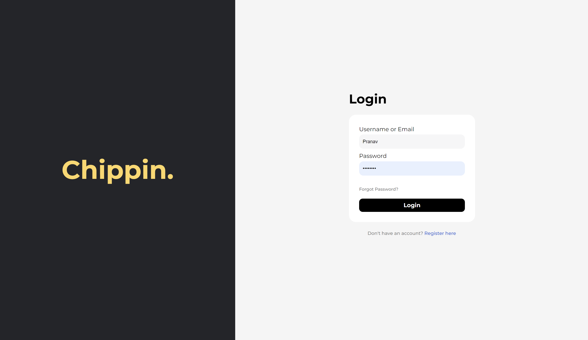
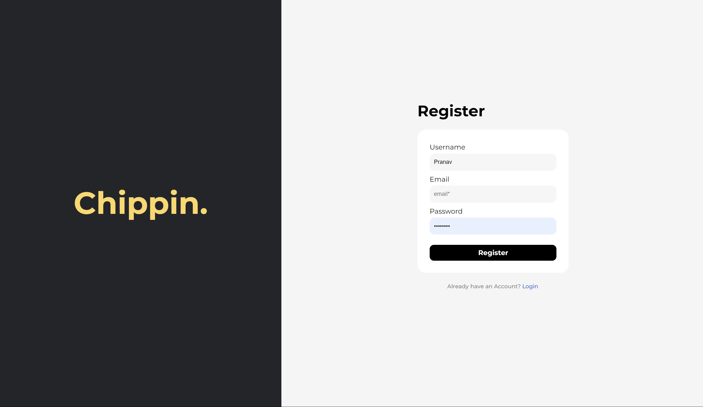
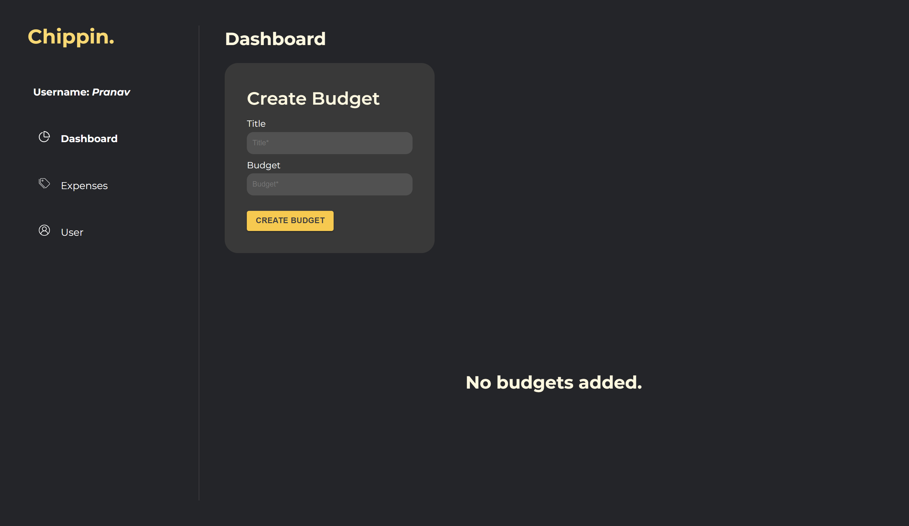
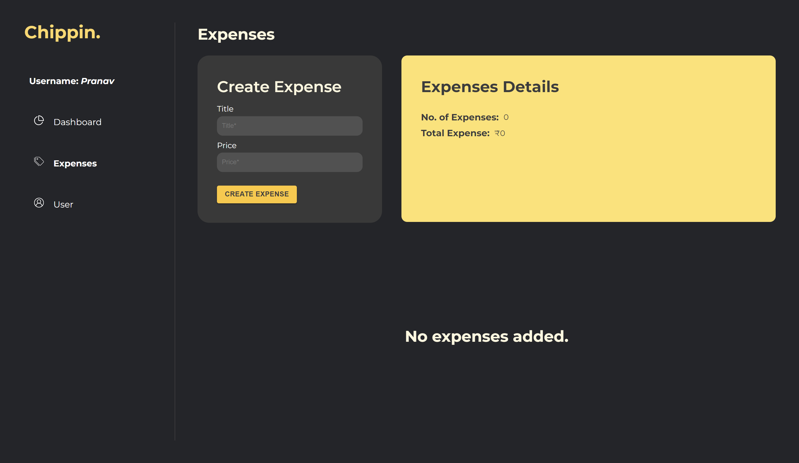
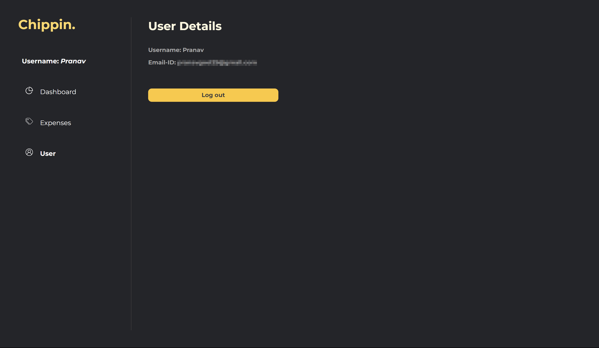

# Chippin

In the Works 🔥,
Expense tracker

## 🚀Features

- Add Budgets
- Add expenses
- Manage expenses

## 📦About Project

Tech Stack:

- React
- TypeScript
- GraphQL
- Type ORM
- PostgresSQL
- React-Hook-Form
- Styled-Components
- Vite

## Getting Started
1. Start the Redis server to initiate the redis instance. (Only applicable if you are using redis locally)

#### <u>For backend</u>
1. Run the watch command. (This will constantly watch over the code and transpile the TS into JS for the build)
2. Run dev/build accordingly.

- Make sure if you are using the cloud redis client to update in the index file and make an `env` with your redis keys.

- Put the 'host' link provided by the redis cloud client as the value for the `REDIS_HOST`. And put the 'passwrod' provided by it as the value of `REDIS_PASSWORD`. And at last don't forget to also put the `port` value for `REDIS_PORT`.

This will allow your Redis to connect with the project.

#### <u>For Client</u>
1. Run the 'gen' command present in `package.json`. (This command will generate the graphQL functions and hooks, this will only run when backend is already spun up)
2. Secondly run the dev command to start the client.

## 📷Screenshots

## 🐛Bug Reporting

Feel free to [open an issue](https://github.com/pranavgoel29/Chippin/issues) on GitHub if you find any bug.
